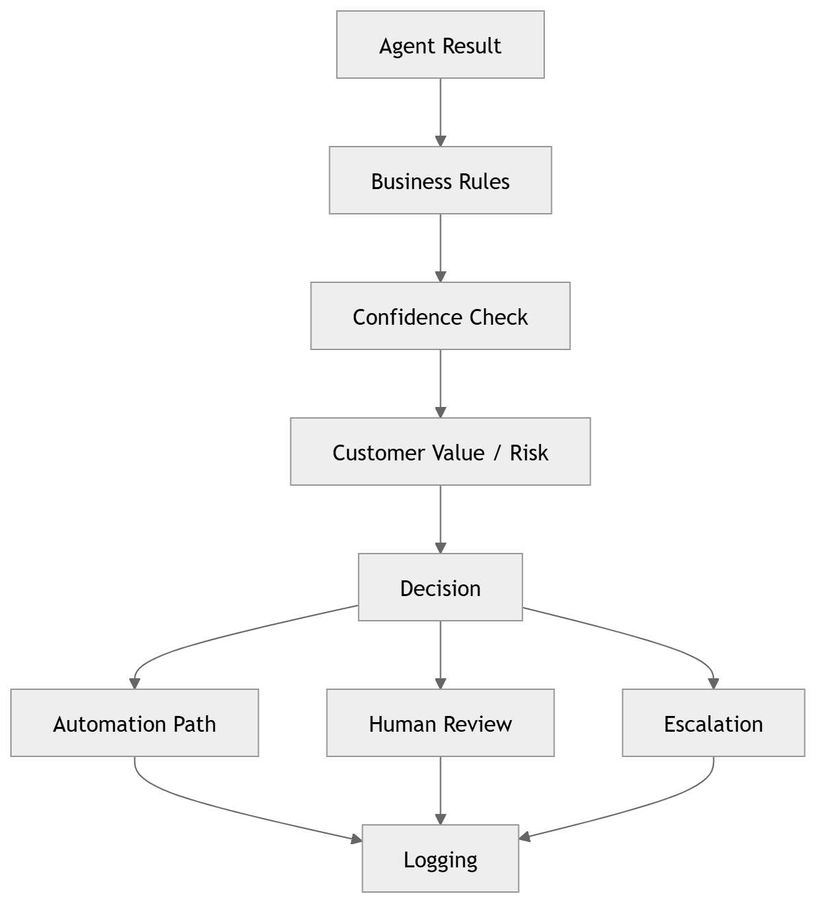
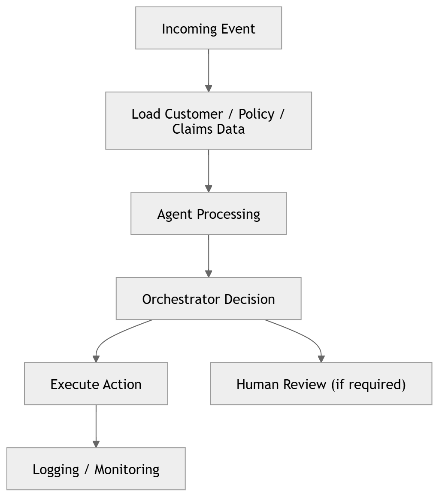
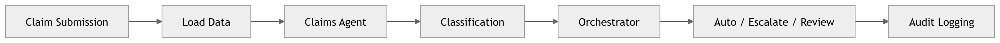
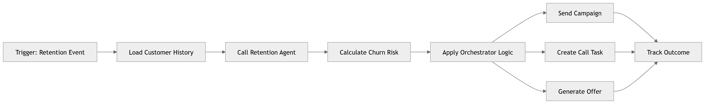
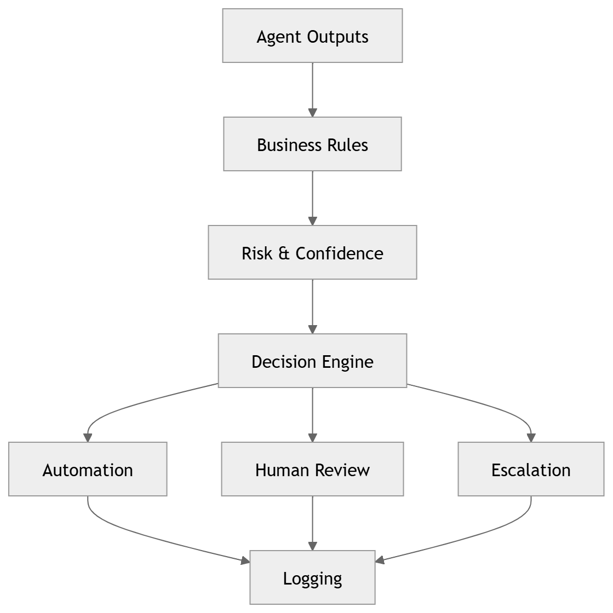
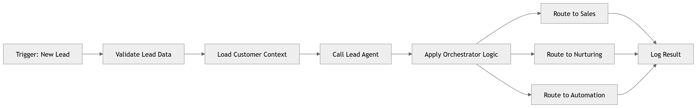
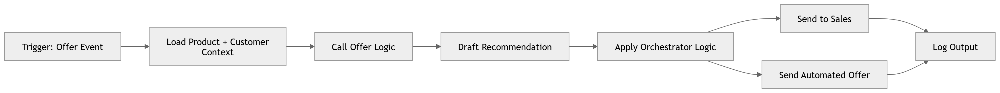
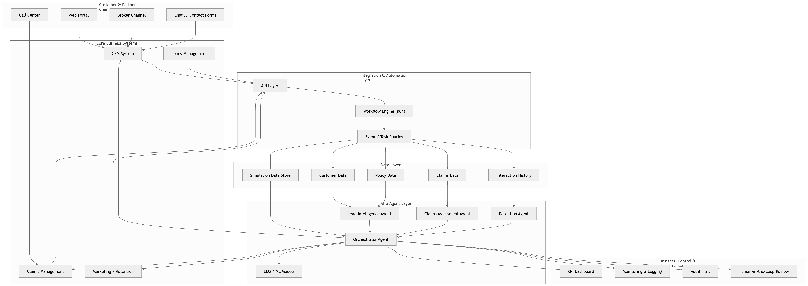

# INSURE.AI — Intelligent Insurance Automation Platform

> AI-powered lead processing, retention, claims assessment, and offer management for modern insurance operations. Built on a classical agent architecture (n8n + FastAPI + LLM).

---

## Table of Contents

- [Overview](#overview)
- [System Architecture](#system-architecture)
- [Core Use Cases](#core-use-cases)
  - [Lead Intelligence](#1-lead-intelligence)
  - [Customer Retention](#2-customer-retention)
  - [Claims Assessment](#3-claims-assessment)
  - [Offer Management](#4-offer-management)
- [Orchestrator & Decision Engine](#orchestrator--decision-engine)
- [Pipeline Detail](#pipeline-detail)
  - [Lead Pipeline](#lead-pipeline)
  - [Retention Pipeline](#retention-pipeline)
  - [Claims Pipeline](#claims-pipeline)
  - [Offer Pipeline](#offer-pipeline)
- [Tech Stack](#tech-stack)
- [Status](#status)

---

## Overview

INSURE.AI is a showcase platform demonstrating how AI agents can automate core insurance workflows. The system ingests events from multiple channels, processes them through specialized AI agents, and routes decisions to the appropriate downstream actions — fully logged and auditable.

**Core design principles:**
- Event-driven, webhook-based ingestion
- Modular agents per use case (Lead, Retention, Claims, Offer)
- Central Orchestrator for routing logic
- Human-in-the-loop escalation paths
- Full audit trail and monitoring

---

## System Architecture

The full platform spans five logical layers: customer-facing channels, core business systems, an integration & automation layer (n8n), a data layer, and the AI & Agent layer with a central Orchestrator.

| Layer | Components |
|---|---|
| **Channels** | Call Center, Web Portal, Broker Channel, Email / Contact Forms |
| **Core Systems** | CRM System, Policy Management, Claims Management, Marketing / Retention |
| **Integration** | API Layer → n8n Workflow Engine → Event / Task Routing |
| **Data** | Customer Data, Policy Data, Claims Data, Interaction History, Simulation Store |
| **AI Agents** | Lead Intelligence Agent, Claims Assessment Agent, Retention Agent |
| **Control** | Orchestrator Agent + LLM/ML Models |
| **Insights** | KPI Dashboard, Monitoring & Logging, Audit Trail, Human-in-the-Loop Review |

---

## Core Use Cases

### 1. Lead Intelligence

Automatically qualifies, scores, and routes incoming leads to the right channel — sales team, nurturing sequence, or full automation.

**Stages:** New Lead → Load Data → Lead Intelligence Agent → Score & Priority → Orchestrator → Sales / Nurturing / Automation → Logging

---

### 2. Customer Retention

Detects churn risk signals, calculates retention scores, and triggers personalized campaigns, call tasks, or tailored offers.

**Stages:** Risk Trigger → Load Customer Data → Retention Agent → Churn Score → Orchestrator → Campaign / Call / Offer → Tracking

---

### 3. Claims Assessment

Classifies and prioritizes incoming claims, then routes them to automated processing, manual review, or escalation.

**Stages:** Claim Submission → Load Data → Claims Agent → Classification → Orchestrator → Auto / Escalate / Review → Audit Logging

---

### 4. Offer Management

Generates personalized product recommendations based on customer and product context, routed to sales or sent as automated offers.

**Stages:** Offer Trigger → Load Context → Offer Agent → Recommendation → Orchestrator → Generate Offer → Store & Log

---

## Orchestrator & Decision Engine

The Orchestrator is the central routing brain of the platform. It evaluates agent outputs against business rules, risk thresholds, and customer value signals before committing to a path.

### Orchestrator Logic (General)

### Decision Engine Detail

Every agent output passes through a four-stage evaluation before routing:

| Stage | Purpose |
|---|---|
| **Business Rules** | Apply hard guardrails and compliance constraints |
| **Confidence Check** | Validate agent confidence score against thresholds |
| **Customer Value / Risk** | Weight decision by customer LTV and risk profile |
| **Decision** | Route to Automation Path, Human Review, or Escalation |

---

## Pipeline Detail

The following diagrams show the full technical pipeline for each use case, including all intermediate steps and branching logic.

### Lead Pipeline

`Trigger: New Lead` → `Validate Lead Data` → `Load Customer Context` → `Call Lead Agent` → `Apply Orchestrator Logic` → `Route to Sales / Nurturing / Automation` → `Log Result`

---

### Retention Pipeline

`Trigger: Retention Event` → `Load Customer History` → `Call Retention Agent` → `Calculate Churn Risk` → `Apply Orchestrator Logic` → `Send Campaign / Create Call Task / Generate Offer` → `Track Outcome`

---

### Claims Pipeline

`Trigger: New Claim` → `Load Claim + Policy Data` → `Call Claims Agent` → `Classification + Priority` → `Apply Orchestrator Logic` → `Auto Process / Manual Review / Escalation` → `Audit Log`

---

### Offer Pipeline

`Trigger: Offer Event` → `Load Product + Customer Context` → `Call Offer Logic` → `Draft Recommendation` → `Apply Orchestrator Logic` → `Send to Sales / Send Automated Offer` → `Log Output`

---

## Tech Stack

| Component | Technology |
|---|---|
| Workflow Engine | n8n |
| Agent Backend | FastAPI (Python) |
| AI / LLM | Claude (Anthropic API) |
| Decision Logic | Custom Orchestrator (rule engine + LLM) |
| Data Storage | PostgreSQL / JSON store |
| Monitoring | Custom logging + KPI Dashboard |

---

## Status

**Advanced MVP — ~80% complete**

- [x] Core pipeline architecture (Lead, Retention, Claims, Offer)
- [x] Agent integration (FastAPI + LLM calls)
- [x] Orchestrator routing logic
- [x] Logging & audit trail
- [ ] KPI Dashboard UI
- [ ] Full Human-in-the-Loop review interface
- [ ] Production deployment & load testing
- [ ] Additional industry verticals

---

*INSURE.AI is designed as a multi-industry showcase. The insurance vertical is the initial implementation; the architecture is extensible to other regulated industries.*

'@
$content | Set-Content -Path "C:\Users\Public\Projects\insure.ai\README.md" -Encoding UTF8
Write-Host "README.md geschrieben"